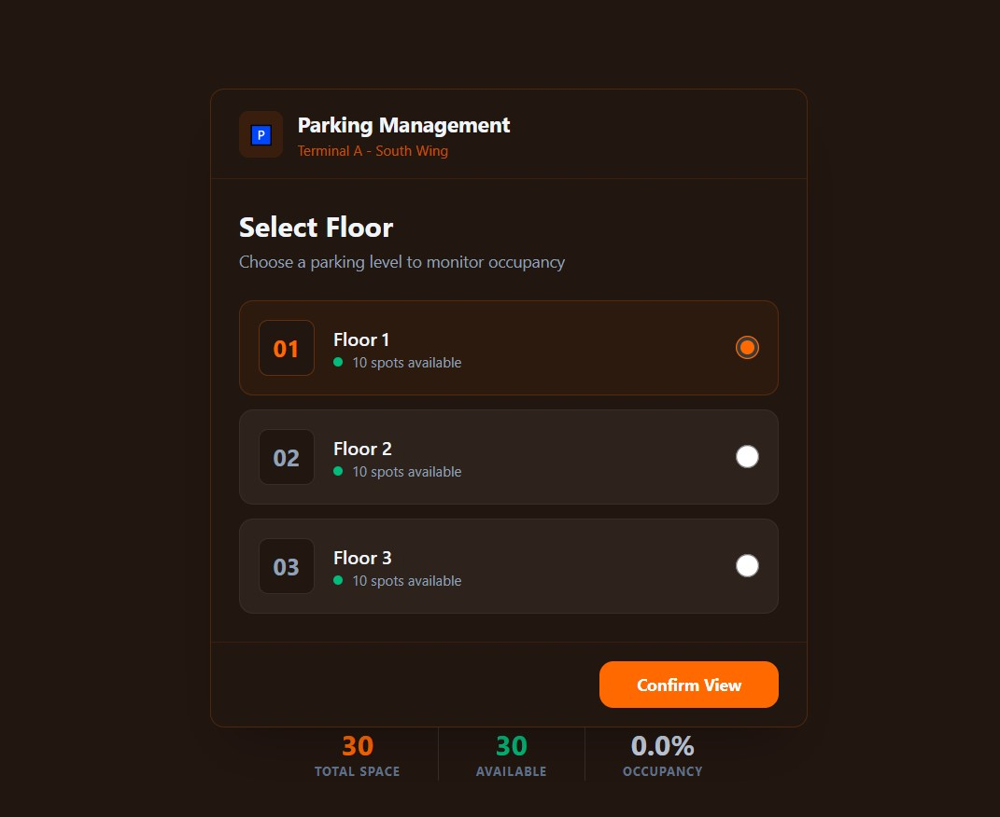
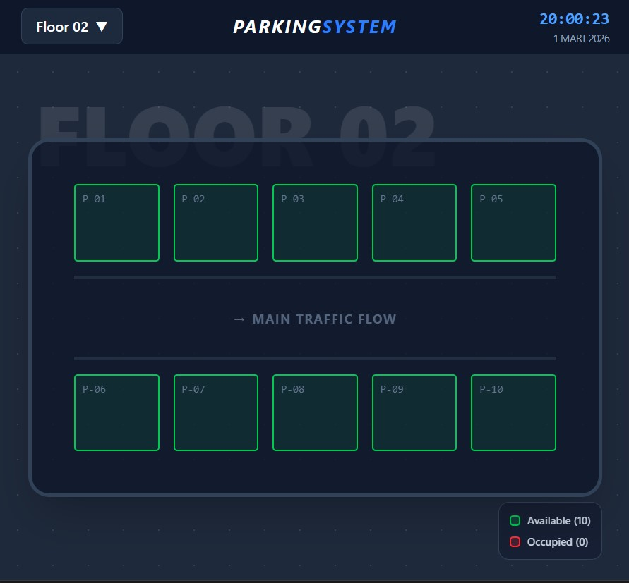
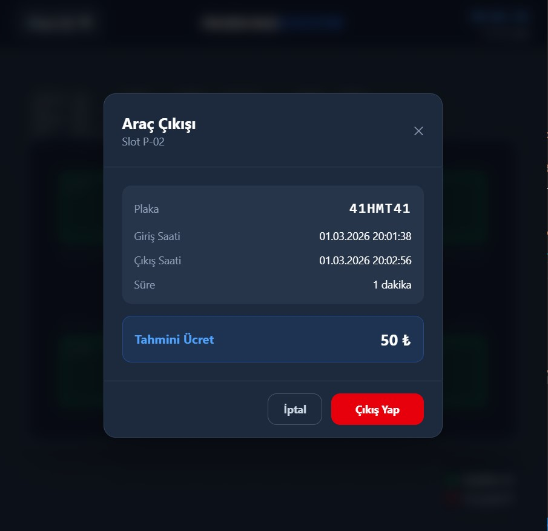
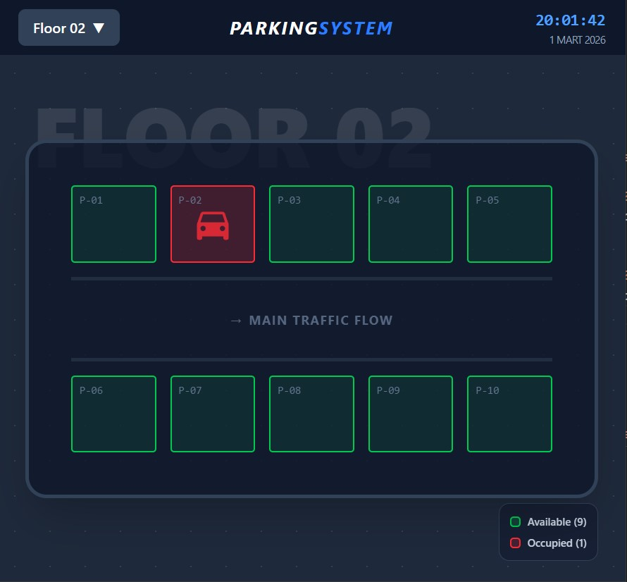

# 🅿️ Parking System

A full-stack parking lot management application built with **Spring Boot** and **React**. The app simulates a 3-floor parking garage where each floor has 10 slots. Users can check in vehicles, monitor occupancy in real time, and check out vehicles with automatic fee calculation.

---

## 📸 Screenshots

### Floor Selection


### Floor View


### Check-In


### Check-Out


### Check-Out

---

## ✨ Features

- 3-floor parking garage simulation with 10 slots per floor
- Real-time occupancy tracking (available / occupied)
- Vehicle check-in with automatic timestamp
- Vehicle check-out with duration and fee calculation
- Tiered pricing: first hour 50₺, each additional hour 30₺
- Interactive floor map with color-coded slot status

---

## 🛠️ Tech Stack

**Backend**
- Java 17
- Spring Boot 3
- Spring Data JPA
- H2 In-Memory Database

**Frontend**
- React 18
- Vite
- Tailwind CSS
- Axios

**UI Design**
- UI mockups created with [Stitch AI](https://stitch.withgoogle.com), then converted to React components

---

## 🚀 Getting Started

### Prerequisites
- Java 17+
- Node.js 18+
- Maven

### Run the Backend

```bash
cd parking-backend
mvn spring-boot:run
```

Backend will start at `http://localhost:8080`

### Run the Frontend

```bash
cd parking-frontend
npm install
npm run dev
```

Frontend will start at `http://localhost:5173`

---

## 📡 API Endpoints

| Method | Endpoint | Description |
|--------|----------|-------------|
| GET | `/slots` | Get all parking slots |
| GET | `/slots/{id}/active` | Get active record for a slot |
| POST | `/slots/{id}/checkin` | Check in a vehicle |
| POST | `/slots/{id}/checkout` | Check out a vehicle |

---

## 💰 Pricing

| Duration | Fee |
|----------|-----|
| First hour | 50₺ |
| Each additional hour | 30₺ |

---

## 📁 Project Structure

```
parking-system/
├── parking-backend/        # Spring Boot application
│   └── src/main/java/
│       ├── controllers/     # REST controllers
│       ├── entities/          # JPA entities
│       ├── repos/     # Spring Data repositories
│       └── services/        # Business logic
│
└── parking-frontend/       # React application
    └── src/
        ├── api/            # Axios API calls
        └── components/     # React components
```
